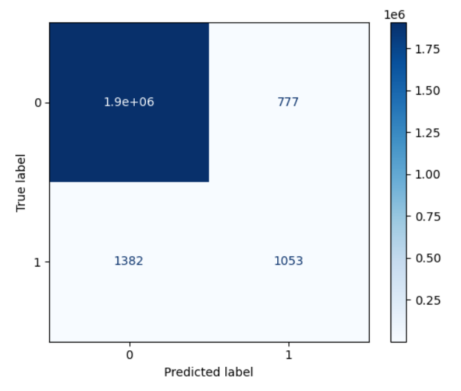

# 🔍 Fraud Detection with Machine Learning

This project uses supervised machine learning models to detect fraudulent transactions. It simulates a real-world workflow involving data preprocessing, model training, evaluation, and deployment-ready automation using GitHub Actions.

---


---

## 📌 Objective

To build and compare machine learning classifiers that identify fraudulent transactions with high precision and recall. The goal is to balance detection accuracy while minimizing false positives.

---

## 🧠 Models Used

- **Logistic Regression**
- **Random Forest**
- **XGBoost Classifier**

Each model was trained on a preprocessed dataset and evaluated using cross-validation and multiple metrics.

---

## 📊 Evaluation Metrics

| Metric          | Purpose                                     |
|-----------------|---------------------------------------------|
| Accuracy        | Overall correctness                         |
| Precision       | How many predicted frauds are correct       |
| Recall          | How many actual frauds were identified      |
| F1-Score        | Harmonic mean of precision and recall       |
| ROC AUC Score   | Separability between classes                |

Confusion matrices and ROC curves were generated to visualize performance.

---

## 🧾 Confusion Matrix




---

## ⚙️ Setup Instructions

### 1. Clone the Repository

```bash
git clone https://github.com/your-username/fraud-detection.git
cd fraud-detection
```
### 2. Install Requirements
```bash
pip install -r requirements.txt
```

### 3. Run Jupyter Notbook
```bash
jupyter notebook
```

## 📊 Dataset
https://drive.google.com/file/d/127JqP3WGjBVihR-ZcUR86T3wwy3_g63v/view

## 📅 Last updated: 2024-05-11
